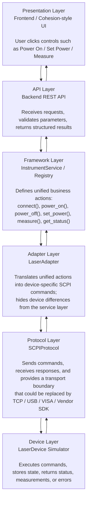

# Instrument Control Simulator

[English](README.md) | [简体中文](README.zh-CN.md)

A lightweight simulation framework for optical test instruments.
Implements SCPI command parsing, firmware lifecycle management,
and real-time instrument status via REST API and React UI.

---

## Architecture



---

## Features

### Instrument Discovery & Connection
- Instrument registry exposed via `GET /api/instruments`
- Per-instrument connect/disconnect with session validation
- Returns identity string (`*IDN?`) on successful connection

### SCPI Command Console
- 10 standard SCPI-like commands over REST API
- Command history with timestamp and response display
- Input validation: power range enforcement, output-state checks
- Deterministic instrument errors for invalid state, unknown commands, and out-of-range values

### Structured Instrument API
- High-level endpoints for common laser operations: output toggle, set power, read measured power
- Backend `LaserAdapter` maps semantic calls to raw SCPI commands
- React control panel uses the structured API while the raw SCPI console remains available

**Supported commands:**

| Command | Description |
|---------|-------------|
| `*IDN?` | Query instrument identity |
| `SYST:VERS?` | Query firmware version |
| `SOUR:POW <val>` | Set output power (-60 to +10 dBm) |
| `SOUR:POW?` | Query current power setting |
| `OUTP ON / OFF` | Enable / disable output |
| `OUTP?` | Query output state |
| `MEAS:POW?` | Measure power (requires output enabled) |
| `SYST:ERR?` | Query last error |
| `*RST` | Reset instrument to defaults |

### Firmware Lifecycle Management
- Lifecycle: `idle -> uploading -> validating -> applying -> completed`
- Progress polling via `GET /api/instruments/{id}/firmware/status`
- Deterministic completion, no random failure rate

### SCPI Script Runner
- Runs newline-delimited SCPI scripts through `POST /api/instruments/{id}/script`
- Ignores blank lines and `#` comments, then returns per-step pass/fail results
- Useful for automated validation flows such as connect -> configure -> enable output -> measure

### Extensible Instrument Framework
- Abstract `InstrumentBase` class — new instrument types drop in without
  changing the API layer
- `InstrumentService`, `LaserAdapter`, `SCPIProtocol`, and `LaserDevice` make the framework layers explicit
- Separation of concerns: API routing, registry/service logic, adapter translation, protocol transport, and device state

### Automated Testing
- **27 pytest tests** — 12 SCPI unit tests + 12 API integration tests + 3 layer tests
- **3 Playwright e2e scenarios** — connect, command flow, firmware upgrade

### Developer Experience
- Single-command startup: `docker compose up`
- GitHub Actions CI: pytest -> frontend build -> Playwright -> Docker build
- Standalone C++ driver mock compiled with CMake (stdin/stdout CLI)

---

## Quick Start

```bash
docker compose up
# Backend:  http://localhost:8000
# Frontend: http://localhost:5173
# API docs: http://localhost:8000/docs
```

### Local development

```bash
# Terminal 1 — backend
cd backend
pip install -r requirements.txt
uvicorn app.main:app --reload

# Terminal 2 — frontend
cd frontend
npm install
npm run dev
```

### Run tests

```bash
# Backend (pytest)
cd backend && pytest tests/ -v

# Frontend e2e (Playwright)
cd frontend && npx playwright test
```

### Build C++ driver

```bash
cd cpp-driver
mkdir build && cd build
cmake ..
cmake --build .
echo "*IDN?" | ./instrument_driver
```

---

## Layer Mapping

| Layer | Implementation |
|-------|----------------|
| Presentation | `frontend/src/App.tsx`, React components |
| API | `backend/app/main.py` |
| Framework | `backend/app/simulator/instrument_service.py` |
| Adapter | `backend/app/simulator/laser_adapter.py` |
| Protocol | `backend/app/simulator/scpi_protocol.py` |
| Device | `backend/app/simulator/laser_device.py` |

---

## Tech Stack

| Layer | Technology |
|-------|-----------|
| Backend | Python 3.12, FastAPI, Pydantic |
| Frontend | React 18, TypeScript, Vite |
| Testing | pytest, Playwright |
| DevOps | Docker, GitHub Actions |
| Driver mock | C++17, CMake |

## Resume-ready Features

- Built a reusable instrument simulation framework with explicit API, Framework, Adapter, Protocol, and Device layers.
- Implemented registry-based instrument discovery and connection management with `*IDN?` identity validation and per-instrument session state.
- Developed a SCPI-style command parser for laser control, including power configuration, output toggling, measurement reads, reset, firmware version, and error queries.
- Added a `LaserAdapter` layer that maps semantic operations such as `set_power`, `power_on`, `power_off`, and `measure` onto raw SCPI commands.
- Designed a firmware upgrade lifecycle with progress polling, version updates, and conflict handling.
- Built a React + TypeScript control UI with instrument discovery, structured laser controls, raw SCPI console, command history, and firmware progress tracking.
- Added newline-delimited SCPI script execution with per-step pass/fail reporting, input validation, and connection enforcement.
- Covered backend and UI workflows with 27 pytest tests and 3 Playwright end-to-end scenarios.
- Set up a Docker Compose local environment and GitHub Actions pipeline for backend tests, frontend build, e2e tests, and Docker image validation.
- Implemented a standalone C++17 driver mock with CMake and stdin/stdout command handling to demonstrate cross-language instrument-control exposure.
