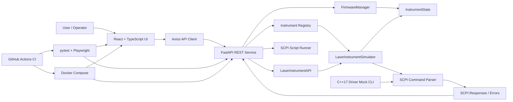

# Instrument Control Simulator

[English](README.md) | [简体中文](README.zh-CN.md)

A lightweight simulation framework for optical test instruments.
Implements SCPI command parsing, firmware lifecycle management,
and real-time instrument status via REST API and React UI.

---

## Features

### Instrument Discovery & Connection
- Instrument registry exposed via `GET /api/instruments`
- Per-instrument connect/disconnect with session validation
- Returns identity string (`*IDN?`) on successful connection

### SCPI Command Console
- 10 standard SCPI-like commands over REST API
- Command history with timestamp and response display
- Input validation: power range enforcement, output-state checks
- 5% simulated random timeout to reflect real instrument behaviour

### Structured Instrument API
- High-level endpoints for common laser operations: output toggle, set power, read measured power
- Backend `LaserInstrumentAPI` maps semantic calls to raw SCPI commands
- React control panel uses the structured API while the raw SCPI console remains available

**Supported commands:**

| Command | Description |
|---------|-------------|
| `*IDN?` | Query instrument identity |
| `SYST:VERS?` | Query firmware version |
| `SOUR:POW <val>` | Set output power (-60 to +10 dBm) |
| `SOUR:POW?` | Query current power setting |
| `OUTP ON / OFF` | Enable / disable output |
| `OUTP?` | Query output state |
| `MEAS:POW?` | Measure power (requires output enabled) |
| `SYST:ERR?` | Query last error |
| `*RST` | Reset instrument to defaults |

### Firmware Lifecycle Management
- State machine: `idle -> uploading -> validating -> applying -> completed / failed`
- Progress polling via `GET /api/instruments/{id}/firmware/status`
- Simulated failure path (10% probability) for robustness testing

### Extensible Instrument Framework
- Abstract `InstrumentBase` class — new instrument types drop in without
  changing the API layer
- `LaserInstrumentAPI` demonstrates a safe instrument SDK layer above SCPI
- Separation of concerns: state, SCPI parser, and firmware manager are
  independent modules

### Automated Testing
- **24 pytest tests** — 12 SCPI unit tests + 12 API integration tests
- **3 Playwright e2e scenarios** — connect, command flow, firmware upgrade

### Developer Experience
- Single-command startup: `docker compose up`
- GitHub Actions CI: pytest -> frontend build -> Playwright -> Docker build
- Standalone C++ driver mock compiled with CMake (stdin/stdout CLI)

---

## Quick Start

```bash
docker compose up
# Backend:  http://localhost:8000
# Frontend: http://localhost:5173
# API docs: http://localhost:8000/docs
```

### Local development

```bash
# Terminal 1 — backend
cd backend
pip install -r requirements.txt
uvicorn app.main:app --reload

# Terminal 2 — frontend
cd frontend
npm install
npm run dev
```

### Run tests

```bash
# Backend (pytest)
cd backend && pytest tests/ -v

# Frontend e2e (Playwright)
cd frontend && npx playwright test
```

### Build C++ driver

```bash
cd cpp-driver
mkdir build && cd build
cmake ..
cmake --build .
echo "*IDN?" | ./instrument_driver
```

---

## Project Structure

```
instrument-control-simulator/
├── backend/
│   ├── app/
│   │   ├── main.py                  # FastAPI app + instrument registry
│   │   ├── models.py                # Pydantic schemas
│   │   └── simulator/
│   │       ├── base.py              # InstrumentBase ABC
│   │       ├── laser_api.py         # structured API over SCPI
│   │       ├── laser_simulator.py   # LaserInstrumentSimulator
│   │       └── firmware.py          # FirmwareManager state machine
│   └── tests/
│       ├── test_scpi.py             # 12 SCPI unit tests
│       └── test_api.py              # 12 API integration tests
├── frontend/
│   ├── src/
│   │   ├── App.tsx
│   │   ├── api/client.ts            # axios API wrapper
│   │   └── components/
│   │       ├── InstrumentList.tsx   # discovery + connect
│   │       ├── ControlPanel.tsx     # structured output/power controls
│   │       ├── CommandConsole.tsx   # SCPI terminal
│   │       └── FirmwarePanel.tsx    # upgrade progress
│   └── e2e/
│       └── instrument.spec.ts       # Playwright: 3 scenarios
├── cpp-driver/
│   ├── instrument_driver.h/cpp      # 6-command driver mock
│   ├── main.cpp                     # stdin/stdout CLI
│   └── CMakeLists.txt
├── docker-compose.yml
└── .github/workflows/ci.yml
```

---

## Tech Stack

| Layer | Technology |
|-------|-----------|
| Backend | Python 3.12, FastAPI, Pydantic |
| Frontend | React 18, TypeScript, Vite |
| Testing | pytest, Playwright |
| DevOps | Docker, GitHub Actions |
| Driver mock | C++17, CMake |

---

## Architecture Diagram



---

## Resume-ready Features

- Built a reusable instrument simulation framework around an `InstrumentBase` abstraction, allowing new instrument types to be added without changing the FastAPI service layer.
- Implemented registry-based instrument discovery and connection management with `*IDN?` identity validation and per-instrument session state.
- Developed a SCPI-style command parser for laser control, including power configuration, output toggling, measurement reads, reset, firmware version, and error queries.
- Added a structured `LaserInstrumentAPI` layer that maps semantic operations such as `set_power`, `set_output`, and `read_power` onto raw SCPI commands.
- Designed a firmware upgrade lifecycle state machine with progress polling, version updates, conflict handling, and simulated failure paths.
- Built a React + TypeScript control UI with instrument discovery, structured laser controls, raw SCPI console, command history, and firmware progress tracking.
- Added newline-delimited SCPI script execution with per-step pass/fail reporting, input validation, and connection enforcement.
- Covered backend and UI workflows with 24 pytest tests and 3 Playwright end-to-end scenarios.
- Set up a Docker Compose local environment and GitHub Actions pipeline for backend tests, frontend build, e2e tests, and Docker image validation.
- Implemented a standalone C++17 driver mock with CMake and stdin/stdout command handling to demonstrate cross-language instrument-control exposure.
