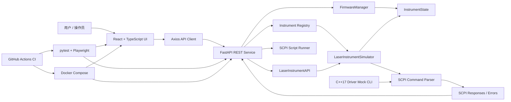

# 仪器控制模拟器

[English](README.md) | [简体中文](README.zh-CN.md)

一个轻量级光学测试仪器模拟框架。
项目实现了 SCPI 命令解析、仪器状态管理、firmware 升级生命周期，以及基于 FastAPI 和 React 的实时状态界面。

---

## 项目功能

### 仪器发现与连接
- 通过 `GET /api/instruments` 暴露仪器注册表，模拟局域网仪器发现
- 支持单台仪器 connect / disconnect
- 连接成功后返回 `*IDN?` 设备身份字符串

### SCPI 命令控制台
- 支持 10 条 SCPI-like 命令
- React UI 显示命令历史、时间戳和响应结果
- 支持功率范围校验、输出状态校验和未知命令错误
- 后端模拟 5% 随机 timeout，用于展示真实仪器控制中的不稳定场景

### 结构化仪器 API
- 为常用激光控制提供高层 endpoint：输出开关、设置功率、读取测量功率
- 后端 `LaserInstrumentAPI` 将语义化调用映射到原始 SCPI 命令
- React 控制面板使用结构化 API，同时保留 raw SCPI command console

**支持命令：**

| 命令 | 说明 |
|------|------|
| `*IDN?` | 查询仪器身份 |
| `SYST:VERS?` | 查询 firmware 版本 |
| `SOUR:POW <val>` | 设置输出功率，范围 -60 到 +10 dBm |
| `SOUR:POW?` | 查询当前功率设置 |
| `OUTP ON / OFF` | 打开 / 关闭输出 |
| `OUTP?` | 查询输出状态 |
| `MEAS:POW?` | 测量当前功率，要求输出已开启 |
| `SYST:ERR?` | 查询最近错误 |
| `*RST` | 重置仪器状态 |

### Firmware 升级生命周期
- 状态机：`idle -> uploading -> validating -> applying -> completed / failed`
- 前端通过 `GET /api/instruments/{id}/firmware/status` 轮询升级进度
- 模拟 10% 失败概率，用于展示错误处理和鲁棒性测试

### 可扩展仪器框架
- `InstrumentBase` 抽象类定义统一接口
- 新仪器类型可继承 `InstrumentBase`，不需要修改 API 层
- `LaserInstrumentAPI` 展示 SCPI 之上的安全仪器 SDK 封装层
- 状态、命令解析、firmware 管理拆分为独立模块

### 自动化测试
- **24 个 pytest 测试**：12 个 SCPI 单元测试 + 12 个 API 集成测试
- **3 个 Playwright e2e 场景**：连接仪器、发送命令、firmware 升级

### 开发体验
- `docker compose up` 一键启动
- GitHub Actions CI：pytest -> frontend build -> Playwright -> Docker build
- C++17 standalone driver mock，使用 CMake 编译，stdin/stdout 交互

---

## 快速启动

```bash
docker compose up
# Backend:  http://localhost:8000
# Frontend: http://localhost:5173
# API docs: http://localhost:8000/docs
```

### 本地开发

```bash
# Terminal 1: backend
cd backend
pip install -r requirements.txt
uvicorn app.main:app --reload

# Terminal 2: frontend
cd frontend
npm install
npm run dev
```

### 运行测试

```bash
# Backend pytest
cd backend && pytest tests/ -v

# Frontend Playwright
cd frontend && npx playwright test
```

### 构建 C++ driver

```bash
cd cpp-driver
mkdir build && cd build
cmake ..
cmake --build .
echo "*IDN?" | ./instrument_driver
```

---

## 项目结构

```
instrument-control-simulator/
├── backend/
│   ├── app/
│   │   ├── main.py                  # FastAPI app + 仪器注册表
│   │   ├── models.py                # Pydantic schemas
│   │   └── simulator/
│   │       ├── base.py              # InstrumentBase 抽象类
│   │       ├── laser_api.py         # SCPI 之上的结构化 API
│   │       ├── laser_simulator.py   # LaserInstrumentSimulator
│   │       └── firmware.py          # FirmwareManager 状态机
│   └── tests/
│       ├── test_scpi.py             # SCPI 单元测试
│       └── test_api.py              # API 集成测试
├── frontend/
│   ├── src/
│   │   ├── App.tsx
│   │   ├── api/client.ts            # axios API wrapper
│   │   └── components/
│   │       ├── InstrumentList.tsx   # discovery + connect
│   │       ├── ControlPanel.tsx     # 结构化输出/功率控制
│   │       ├── CommandConsole.tsx   # SCPI terminal
│   │       └── FirmwarePanel.tsx    # upgrade progress
│   └── e2e/
│       └── instrument.spec.ts       # Playwright e2e
├── cpp-driver/
│   ├── instrument_driver.h/cpp      # C++ driver mock
│   ├── main.cpp                     # stdin/stdout CLI
│   └── CMakeLists.txt
├── docker-compose.yml
└── .github/workflows/ci.yml
```

---

## 技术栈

| 层级 | 技术 |
|------|------|
| Backend | Python 3.12, FastAPI, Pydantic |
| Frontend | React 18, TypeScript, Vite |
| Testing | pytest, Playwright |
| DevOps | Docker, GitHub Actions |
| Driver mock | C++17, CMake |

---

## 项目架构图



---

## 简历项目 Features

- 基于 `InstrumentBase` 抽象类搭建可复用仪器模拟框架，新仪器类型可扩展接入，不需要修改 FastAPI 服务层。
- 实现 registry-based 仪器发现与连接管理，支持 `*IDN?` 身份校验和单仪器 session 状态维护。
- 开发 SCPI-style 命令解析器，覆盖功率设置、输出开关、测量读取、重置、firmware 版本查询和错误查询等控制流程。
- 封装 `LaserInstrumentAPI` 结构化仪器控制层，将 `set_power`、`set_output`、`read_power` 等语义化操作映射到原始 SCPI 命令。
- 设计 firmware 升级生命周期状态机，支持进度轮询、版本更新、并发冲突处理和失败路径模拟。
- 构建 React + TypeScript 控制界面，包含仪器发现、结构化激光控制、raw SCPI console、命令历史和 firmware 进度展示。
- 增加 newline-delimited SCPI script runner，返回逐步 pass/fail 报告，并实现输入校验与连接状态约束。
- 使用 24 个 pytest 测试和 3 个 Playwright e2e 场景覆盖后端逻辑、API 集成和核心 UI 流程。
- 配置 Docker Compose 本地环境与 GitHub Actions CI，覆盖 backend tests、frontend build、e2e tests 和 Docker image validation。
- 实现 C++17 standalone driver mock，使用 CMake 构建并通过 stdin/stdout 处理控制命令，展示跨语言仪器控制能力。
